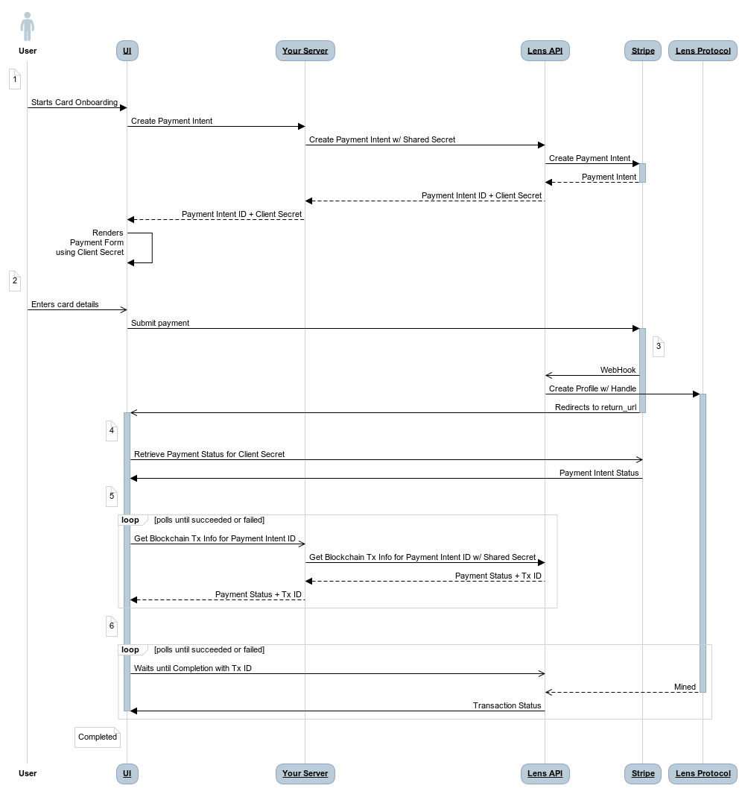

# Onboarding

Learn how to onboard new users to DiGi.
---

The process of onboarding a new user involves minting a new Profile NFT. This can be accomplished either by the user themselves in a self-funded manner, or by a third party on behalf of the user.

### Choosing a Handle

Typically, users will choose their Handle during the onboarding process. They can only choose the local-name portion of the Handle, such as wagmi in digi/wagmi. The namespace is currently fixed to digi on Polygon Mainnet and test on Mumbai Testnet.

Here are the rules to follow when choosing an Handle:

  * Length: The local-name should be between 5-26 characters. For example, digi/wagmi is correct, but digi/wagm is too short.

  * Uniqueness: The Handle must be unique. If you try to create a Handle that already exists, the minting will fail.
 
  * Character Types: Handles must consist of alphanumeric characters and underscores (_), but they must not start with _ or a digit (0-9).

  * Case Insensitivity: Handles are case-insensitive. So digi/wagmi and digi/Wagmi are considered the same Handle.

### Crypto Onboarding

In crypto self-funded onboarding, the user is guided through the process of creating a DiGi Profile with their desired Handle for a fee of 8 MATIC. As this process uses the user's wallet to send the transaction, it cannot be gasless and requires the user's signature.

# React SDK

The examples provided use @digiv3rse/react-web for creating an onboarding webpage. This process can also be applied in React Native using the @digiv3rse/react-native package.

Start by connecting the user's wallet. Although the example uses a basic [Wagmi](https://wagmi.sh/) setup, it can be adapted to suit different requirements.


```typescript title="OnboardingPage.tsx"

import { useAccount, useConnect } from "wagmi";
import { injected } from "wagmi/connectors";

import { CreateProfileForm } from "./CreateProfileForm";

export function OnboardingPage() {
  const { address, isDisconnected, isConnecting } = useAccount();
  const { connect } = useConnect();

  if (isDisconnected && !address) {
    return (
      <button
        disabled={isConnecting}
        onClick={() => connect({ connector: injected() })}
      >
        Connect Wallet
      </button>
    );
  }

  return <CreateProfileForm wallet={address} />;
}
```
Next, we'll focus on the <CreateProfileForm> component, which allows the user to choose their desired Handle.

You can use the useValidateHandle hook to check if the desired handle is available.

```typescript title="CreateProfileForm.tsx"

import { useState } from "react";
import { useValidateHandle } from "@digiv3rse/react-web";

type CreateProfileFormProps = {
  wallet: string;
};

export function CreateProfileForm({ wallet }: CreateProfileFormProps) {
  const [localName, setLocalName] = useState("");
  const { execute: validateHandle, loading: verifying } = useValidateHandle();

  const submit = async () => {
    const result = await validateHandle({ localName });

    if (result.isFailure()) {
      console.error();
      return;
    }

    // TODO: mint profile
  };

  return (
    <form onSubmit={submit}>
      <input
        type="text"
        disabled={verifying}
        value={localName}
        onChange={(e) => setLocalName(e.target.value)}
      />

      <button type="submit" disabled={verifying}>
        Create
      </button>
    </form>
  );
}
```
Finally, use the useCreateProfile hook to mint the new Profile.

```typescript title="CreateProfileForm.tsx"

import { useState } from "react";
import { useCreateProfile, useValidateHandle } from "@digiv3rse/react-web";

type CreateProfileFormProps = {
  wallet: string;
};

export function CreateProfileForm({ wallet }: CreateProfileFormProps) {
  const [localName, setLocalName] = useState("");
  const { execute: validateHandle, loading: verifying } = useValidateHandle();
  const { execute: createProfile, loading: creating } = useCreateProfile();

  const submit = async () => {
    const result = await validateHandle({ localName });

    if (result.isFailure()) {
      window.alert(result.error.message);
      return;
    }

    const result = await execute({ localName, to: address });

    if (result.isFailure()) {
      window.alert(result.error.message);
      return;
    }

    const profile = result.value;
    window.alert(
      `Congratulations! You now own: ${profile.handle?.fullHandle}!`
    );
  };

  return (
    <form onSubmit={submit}>
      <input
        type="text"
        disabled={verifying || creating}
        value={localName}
        onChange={(e) => setLocalName(e.target.value)}
      />

      <button type="submit" disabled={verifying || creating}>
        Create
      </button>
    </form>
  );
}
```
That's it–you can now log in the user with the useLogin hook and their newly created Profile ID.

### Manual Contract Call

You can onboard a new user to DiGi by allowing them to mint a profile with a handle using the new PermissionlessCreator smart contract directly. This section will guide you through the process of minting a DiGi profile with a handle using the JavaScript SDK (i.e. DiGiClient) or the DiGi GraphQL API.

The process is as follows:

1. Validate the requested new handle and check its availability.

2. Gather the necessary input data to mint a new profile with a handle.

3. Submit the mint transaction.

4. Proceed with optional next steps.

### 1. Validate the Requested Handle

The handle must adhere to specific rules to be considered valid. The DiGi SDKs provide a straightforward isValidHandle function to verify the validity of a handle.

```TypeScript

import { isValidHandle } from "@digiv3rse/client";

const requestedHandle = "wagmi"; // input from the user

if (!isValidHandle(requestedHandle)) {
  console.error(`Invalid handle`);
}
```
The next step is to verify if the requested handle is available. Here's how you can do it using the DiGiClient.

```TypeScript

import { DiGiClient, production } from "@digiv3rse/client";

const client = new DiGiClient({
  environment: production,
});

const HANDLE_NAMESPACE = "digi"; // use 'test' namespace with 'development' environment

const handleOwnerAddress = await client.handle.resolveAddress({
  handle: `${HANDLE_NAMESPACE}/${requestedHandle}`,
});

if (handleOwnerAddress) {
  console.error(`The requested handle is not available.`);
}
```
You can also directly query the DiGi GraphQL API.

**Query**

```
query {  
  handleToAddress(request: { handle: "digi/wagmi" })  
}
```
**Response**

```
{
  "data": {
    "handleToAddress": null // or owner wallet address
  }
}
```
### 2. Gather the Required Data for Minting

The PermissionlessCreator smart contract provides two methods that are crucial for this tutorial. Below is a snippet from the ABI. You can find the addresses of the deployed contracts page.

```json title="PermissonlessCreator.json"
[
  {
    "inputs": [],
    "name": "getProfileWithHandleCreationPrice",
    "outputs": [
      {
        "internalType": "uint256",
        "name": "",
        "type": "uint256"
      }
    ],
    "stateMutability": "view",
    "type": "function"
  },
  {
    "inputs": [
      {
        "components": [
          {
            "internalType": "address",
            "name": "to",
            "type": "address"
          },
          {
            "internalType": "address",
            "name": "followModule",
            "type": "address"
          },
          {
            "internalType": "bytes",
            "name": "followModuleInitData",
            "type": "bytes"
          }
        ],
        "internalType": "struct Types.CreateProfileParams",
        "name": "createProfileParams",
        "type": "tuple"
      },
      {
        "internalType": "string",
        "name": "handle",
        "type": "string"
      },
      {
        "internalType": "address[]",
        "name": "delegatedExecutors",
        "type": "address[]"
      }
    ],
    "name": "createProfileWithHandle",
    "outputs": [
      {
        "internalType": "uint256",
        "name": "profileId",
        "type": "uint256"
      },
      {
        "internalType": "uint256",
        "name": "handleId",
        "type": "uint256"
      }
    ],
    "stateMutability": "payable",
    "type": "function"
  }
]
```
The createProfileWithHandle method is what we'll use to mint a new profile with a handle. To call this method, we need to provide the following parameters:

 * to: The wallet address of the new profile owner.

 * handle: The local-name part of a requested handle. The namespace is assigned automaticaly.

 * delegatedExecutors: An array of addresses that are allowed to execute transactions on behalf of the new profile owner. This enables the Profile Manager to be activated along with the profile creation.
 * value: The price to mint a new profile with a handle.

 * followModule and followModuleInitData: These are for advanced use and we'll leave them out for now.

To enable the Signless Experience you will need to provide the DiGi Relayer address as one of the Profile Managers. You can retrieve this address from the DiGi API using the JavaScript SDK (i.e. DiGiClient) or the DiGi GraphQL API.

```javascripy title="JavaScript SDK"

const relayerAddress = await client.transaction.generateDiGiAPIRelayAddress();
```
You can retrieve the price of minting a new profile with a handle using the getProfileWithHandleCreationPrice method.

- Viem

```typescript name="viem"
import { createPublicClient, createWalletClient, http, custom } from 'viem'
import { mainnet } from 'viem/chains'

import abi from "./permissonless-creator.json" assert { type: "json" };

// setup all what is required to interact with the contract
export const publicClient = createPublicClient({
  chain: mainnet,
  transport: http(),
})
export const walletClient = createWalletClient({
  chain: mainnet,
  transport: custom(window.ethereum!),
})

// init the contract
const permissonlessCreator = getContract({
  address: CONTRACT_ADDRESS,
  abi,
  client: { public: publicClient, wallet: walletClient }
});

// get the mint price
const price = await permissonlessCreator.read.getProfileWithHandleCreationPrice();
```
- Ethers
```typescript name="ethers"
import { ethers } from "ethers";
import abi from "./permissonless-creator.json" assert { type: "json" };

// setup all what is required to interact with the contract
const provider = new ethers.providers.JsonRpcProvider(RPC_PROVIDER_URL);
const wallet = new ethers.Wallet(WALLET_PRIVATE_KEY, provider);

// init the contract
const permissonlessCreator = new ethers.Contract(
  CONTRACT_ADDRESS,
  abi,
  wallet
) as PermissonlessCreator;

// get the mint price
const price = await permissonlessCreator.getProfileWithHandleCreationPrice();
```
### 3. Submit the Mint Transaction

Now that we have all the required data, we can proceed to mint a new profile with a handle. We also have an instance of the PermissionlessCreator smart contract ready to use from the previous step.

Let's go ahead and submit the mint transaction.

- Viem
```typescript
const hash = await permissonlessCreator.write.createProfileWithHandle(
  {
    to: wallet.address,
    followModule: "0x0000000000000000000000000000000000000000",
    followModuleInitData: "0x",
  },
  requestedHandle, // "wagmi"
  [relayerAddress],
  {
    value: price,
  }
);

console.log(
  `Transaction to create a new profile with handle was successfully broadcasted with hash`,
  hash
);

console.log(`Waiting for the transaction to be indexed...`);
const outcome = await client.transaction.waitUntilComplete({
  forTxHash: hash,
});

if (outcome === null) {
  console.error(`The transaction with hash ${hash} was lost.`);
  process.exit(1);
}

console.log("A new profile with handle has been successfully minted.");
```
- Ethers

````typescript
const tx = await permissonlessCreator.createProfileWithHandle(
  {
    to: wallet.address,
    followModule: "0x0000000000000000000000000000000000000000",
    followModuleInitData: "0x",
  },
  requestedHandle, // "wagmi"
  [relayerAddress],
  {
    value: price,
  }
);

console.log(
  `Transaction to create a new profile with handle was successfully broadcasted with hash`,
  tx.hash
);

console.log(`Waiting for the transaction to be indexed...`);
const outcome = await client.transaction.waitUntilComplete({
  forTxHash: tx.hash,
});

if (outcome === null) {
  console.error(`The transaction with hash ${tx.hash} was lost.`);
  process.exit(1);
}

console.log("A new profile with handle has been successfully minted.");
````
That's it—you've successfully minted a new profile with a handle using the PermissionlessCreator smart contract.

### 4. Optional Next Steps

After the transaction is indexed by DiGi API we recommend the following next steps:

Fetch the newly minted profile.
Authenticate the profile with the API.
Update the Profile Metadata.
The steps you choose to implement depend on your application's needs.

The complete onboarding script using the JavaScript SDK can be found in the examples folder of the [DiGi SDK GitHub repository](https://github.com/digiv3rse/sdk).

## Credited Onboarding

For applications with unique onboarding requirements, a credit system for onboarding is available to cater to these needs.

Recognized app builders are granted an initial number of credits by the DiGi Protocol team. These credits can be used to mint new Profile in behalf of the app new users. Each credit used reduces the total number of credits available to the app.

📘
If you choose to charge users for onboarding with this integration, you must align with the DiGi Protocol fees, which are 8 MATIC for crypto payments or 10 USD for fiat payments.
If you're interested in obtaining credits for your app, please reach out to the DiGi Protocol team via this form.

Below are the PermissionlessCreator contract features that can be utilized to mint new Profiles using credits.

Profile Minting

The createProfileWithHandleUsingCredits function, available on the PermissionlessCreator smart contract, allows the minting of a new Profile with Handle using credits. This function operates similarly to createProfileWithHandle, but it doesn't require a fee. Instead, the app builder can utilize their credits to mint the new profile for the user.

📘
Note

This function must be invoked from the address that holds the credits.
````solidity

function createProfileWithHandleUsingCredits(
  Types.CreateProfileParams calldata createProfileParams,
  string calldata handle,
  address[] calldata delegatedExecutors
) external returns (uint256 profileId, uint256 handleId);

struct CreateProfileParams {
  address to;
  address followModule;
  bytes followModuleInitData;
}
````

The app builder can use the delegatedExecutors parameter to set up Profile Manager addresses on the newly created Profile. If the DiGi Relayer address is included in the delegatedExecutors array, this effectively enables the Signless Experience for the new Profile.

## Lazy Onboarding

We've made it possible to mint Profile and Handle independently using credits. Consider minting a batch of Profiles without Handles in advance. These can be held in reserve and transferred to new users during their onboarding process. The Handle can then be minted lazily, according to the user's request.

This method provides a seamless experience, enabling users to authenticate and start using the app immediately. The Handle is minted in the background, and once it's successfully created, it can be transferred and linked to the user's Profile smoothly.

Use the createProfileUsingCredits function to mint a new Profile without a Handle using credits.

````solidity

function createProfileUsingCredits(
  Types.CreateProfileParams calldata createProfileParams,
  address[] calldata delegatedExecutors
) external returns (uint256);

struct CreateProfileParams {
  address to;
  address followModule;
  bytes followModuleInitData;
}
````

Use the createHandleWithCredits function to mint a new Handle using credits.

````solidity

function createHandleWithCredits(
  address to,
  string calldata handle
) external returns (uint256);
````

Use the standard ERC-721 transferFrom method on the Handle NFT contract (refer to DiGiHandles in smart contracts) to transfer the Handle to the user.

## Transfer Profile

Once the Profile is minted, the app builder can transfer it to the user using the standard ERC-721 transferFrom method on the Profile NFT contract (refer to DiGiHub in smart contracts).

If the Profile was created with delegatedExecutors (i.e., Profile Manager addresses), the transferFromKeepingDelegates function should be used to maintain this configuration after transferring the Profile to the user. This function is available on the PermissionlessCreator smart contract.

````solidity

function transferFromKeepingDelegates(
  address from,
  address to,
  uint256 tokenId
) external;
````

> 📘 Note: This function must be invoked by the address that initially minted the profile.

## Creative Approaches

It's worth noting that the credit address you provide to the DiGi Protocol team can be a smart contract. This allows you to incorporate flexible rules into your onboarding process. For instance, you could set conditions such as requiring users to hold a specific NFT, or you could charge your own fee for onboarding. All these conditions can be composed on-chain.

> 📘 Note: We recommend making your contracts upgradable proxies to easily adapt their criteria as needs evolve.

Below, we provide two examples to illustrate the simplicity of creating a wrapper contract. However, the possibilities are endless, and you can customize your contract to suit your specific needs.

````solidity
// SPDX-License-Identifier: MIT

pragma solidity ^0.8.19;

import {Ownable} from '@openzeppelin/contracts/access/Ownable.sol';

struct CreateProfileParams {
    address to;
    address followModule;
    bytes followModuleInitData;
}

interface IPermissonlessCreator {
    function createProfileUsingCredits(
        CreateProfileParams calldata createProfileParams,
        address[] calldata delegatedExecutors
    ) external returns (uint256);

    function createProfileWithHandleCredits(
        CreateProfileParams calldata createProfileParams,
        string calldata handle,
        address[] calldata delegatedExecutors
    ) external returns (uint256, uint256);

    function createHandleWithCredits(
        address to,
        string calldata handle
    ) external returns (uint256);
}

contract AppChargeDiGiOnboarding is Ownable {
    // load the permissonless creator contract
    IPermissonlessCreator public immutable PERMISSONLESS_CREATOR;

    // the cost to buy a profile with handle
    uint256 public profileWithHandleCreationCost = 1 ether;

    error InvalidFunds();

    constructor(address owner, address permissonlessCreator) {
        _transferOwnership(owner);
        PERMISSONLESS_CREATOR = IPermissonlessCreator(permissonlessCreator);
    }

    // charge funds send to your beneficiary and then create profile for the user
    function createProfileWithHandle(
        CreateProfileParams calldata createProfileParams,
        string calldata handle,
        address[] calldata delegatedExecutors
    ) external payable returns (uint256 profileId, uint256 handleId) {
        if (msg.value != profileWithHandleCreationCost) {
            revert InvalidFunds();
        }

        // delegatedExecutors are only allowed if to == msg.sender
        if (delegatedExecutors.length > 0 && createProfileParams.to != msg.sender) {
            revert NotAllowed();
        }

        return PERMISSONLESS_CREATOR.createProfileWithHandleCredits(createProfileParams, handle, delegatedExecutors);
    }

    function withdrawFunds() external onlyOwner {
        payable(owner()).transfer(address(this).balance);
    }
}
````

````solidity
// SPDX-License-Identifier: MIT

pragma solidity ^0.8.19;

import {Ownable} from '@openzeppelin/contracts/access/Ownable.sol';

struct CreateProfileParams {
    address to;
    address followModule;
    bytes followModuleInitData;
}

interface IPermissonlessCreator {
    function createProfileUsingCredits(
        CreateProfileParams calldata createProfileParams,
        address[] calldata delegatedExecutors
    ) external returns (uint256);

    function createProfileWithHandleCredits(
        CreateProfileParams calldata createProfileParams,
        string calldata handle,
        address[] calldata delegatedExecutors
    ) external returns (uint256, uint256);

    function createHandleWithCredits(
        address to,
        string calldata handle
    ) external returns (uint256);
}

// onboard digi users for free
contract AppFreeDiGiOnboarding is Ownable {
    // load the permissionless creator contract
    IPermissonlessCreator public immutable PERMISSONLESS_CREATOR;

    // your EOAs which can do this transactions can be
    // a list of defender addresses or a list of your own EOAs
    // these will send the transactions
    mapping(address => bool) public allowedAddresses;

    // modifier to only allow your allowed address to do it
    modifier onlyAllowed() {
        require(allowedAddresses[msg.sender], 'AppFreeDiGiOnboarding: Not allowed');
        _;
    }

    constructor(address owner, address permissonlessCreator) {
        _transferOwnership(owner);
        PERMISSONLESS_CREATOR = IPermissonlessCreator(permissonlessCreator);
    }

    // add to the allowed addresses
    function addAllowedAddresses(address[] calldata newAddresses) external onlyOwner {
        for (uint256 i = 0; i < newAddresses.length; i++) {
            allowedAddresses[newAddresses[i]] = true;
        }
    }

    // remove the allowed addresses
    function removeAllowedAddress(address newAddress) external onlyOwner {
        allowedAddresses[newAddress] = false;
    }

    // check if they are allowed addresses
    function isAllowedAddress(address newAddress) external view returns (bool) {
        return allowedAddresses[newAddress];
    }

    // checks onlyAllowed and then mints it from the credits
    function createProfileWithHandle(
        CreateProfileParams calldata createProfileParams,
        string calldata handle,
        address[] calldata delegatedExecutors
    ) external onlyAllowed returns (uint256 profileId, uint256 handleId) {
        return PERMISSONLESS_CREATOR.createProfileWithHandleCredits(createProfileParams, handle, delegatedExecutors);

}
````

Alternatively, you could use an Externally Owned Account (EOA) and manage the gating on the backend. This flexibility makes it a highly adaptable onboarding system.

Card Onboarding
In the card onboarding, the user is guided through the process of creating a DiGi Profile with their desired Handle for a fee of 10 USD.

This feature is enabled through an integration with Stripe, a popular payment gateway. The Custom payment flow from Stripe is used, offering flexibility to customize the payment experience to suit your needs.

> 📘 Please note that this guide is more > > complex and requires your application to > have a server-side component to manage > > server-to-server requests.

### Integration Overview

The following sequence diagrams shows in broad strokes how the integration works.



The process unfolds as follows:

1. Upon user initiation, the UI creates a Payment Intent via a bespoke server-side endpoint and initializes the Stripe Checkout form using the obtained Client Secret.

2. The user enters their card details and follows the payment instructions provided by their card provider.

3. Once the payment is successful, Stripe communicates with the DiGi API, triggering the on-chain Profile creation process. Stripe also redirects the UI to the specified return_url.

4. The UI verifies the payment outcome using the Client Secret from step 1.

5. After verifying the successful payment, the UI begins checking for Blockchain Transaction Info associated with the Payment Intent ID from step 1.

6. Once the UI receives confirmation from the DiGi API, it waits for the completion of the Create Profile Transaction. This process uses the Transaction ID obtained earlier, as explained in the DiGi Transaction Status guide.

Finally, the UI can fetch the newly created Profile and continue with the onboarding process.

### Shared Secret

The DiGi API provides two bespoke endpoints for this integration:

* POST /payments/create

* GET /payments/<paymentIntentId>/blockchain-tx-info

These endpoints are available at the specified paths on the DiGi API URL for each environment.

To use these endpoints, contact the DiGi Protocol team to obtain a shared secret for your application. This shared secret should be included in the x-shared-secret HTTP headers when making requests to these endpoints.

> 📘 This shared secret is a sensitive piece of information intended for server-to-server communication. It should never be exposed on the client-side.

### Create Payment Intent

Use the POST /payments/create endpoint to create a Payment Intent. This endpoint requires the user's wallet address and the desired Handle local-name. The DiGi API will respond with the Payment Intent's client secret, which you can use to initiate the Stripe Checkout form.

#### Request

```HTTP
POST /payments/create
Host: <api-url>
x-shared-secret: <shared-secret>
Accept: application/json
Content-Type: application/json
Content-Length: 103

{
  "address": "0x1234567890abcdef1234567890abcdef12345678",
  "handle": "wagmi",
  "currency": "usd"
}
```

|Body Parameter    |                             |
|------------------|-----------------------------|
| address          |The user's wallet address.   |
|                  |If the payment is successful,|
|                  |Profile and Handle NFTs will | 
|                  |be minted to this address.   | 
|                  |                             |
| handle           |The local-name portion of the|
|                  |desired Handle.              |
|                  |For example, for digi/wagmi, |
|                  |the handle is wagmi.         |
|                  |                             |
| currency         |(optional)	The currency for  |
|                  |the payment. Currently, only |
|                  |usd is supported. If not     |
|                  |specified, it defaults to usd.|

#### Response

[](#response)

SuccessFailure

`HTTP/1.1 200 OK Content-Type: application/json Content-Length: 137  {   "id": "pi_1J3xjz2eZvKYlo2C5z3z",   "for": "0x1234567890abcdef1234567890abcdef12345678",  "clientSecret": "pi_1J3xjz2eZvKYlo2C5z3z" }`

`HTTP/1.1 400 Bad Request Content-Type: text/plain Content-Length: 21  HANDLE_ALREADY_EXISTS`

Response Property

Description

`id`

The Payment ID. This will be used to retrieve the Transaction ID associated with the payment.

`for`

This is the ethereum address the profile and handle will be minted to if the payment succeeds

`clientSecret`

The Payment Intent's [client secret](https://docs.stripe.com/api/payment_intents/object#payment_intent_object-client_secret) to be used with Stripe SDK.

### Failures

[](#failures)

Status Code

Body

`400`

`INVALID_CURRENCY`

`400`

`INVALID_ETHEREUM_ADDRESS`

`400`

`INVALID_HANDLE`

`400`

`HANDLE_ALREADY_EXISTS`

`400`

`FAILED_TO_CREATE_PAYMENT`

Get Blockchain Info

[](#get-blockchain-info)
-----------------------------------------------

Use the `GET /payments/<paymentIntentId>/blockchain-tx-info` endpoint to retrieve the Blockchain Transaction Info associated with a specific Payment Intent ID that was previously created.

### 

Request

[](#request-1)

HTTP

`GET /payments/<paymentIntentId>/blockchain-tx-info Host: <api-url> x-shared-secret: <shared-secret> Accept: application/json`

URL Parameter

Description

`paymentIntentId`

The Payment Indent ID from the `POST /payments/create` response.

### 

Response

[](#response-1)

HTTP

`HTTP/1.1 200 OK Content-Type: application/json Content-Length: 160  {   "status": "FULL_SUCCESS",   "txId": "a8b3a0f9-87d7-42e5-b214-31ea3b76247b",   "handle": "wagmi",   "address": "0x1234567890abcdef1234567890abcdef12345678" }`

Response Property

Value

Description

`status`

The status of the Card Onboarding.

`CREATED_PAYMENT`

The Payment Intent has been created.

`PROCESSING_PAYMENT`

The payment is currently being processed.

`FAILED_PAYMENT`

The payment has failed.

`SUCCESS_PAYMENT`

The payment was successful, but the Create Profile transaction has not been sent yet.

`FULL_SUCCESS`

The payment was successful and the Create Profile transaction has been sent.

`SUCESSS_PAYMENT_BLOCKCHAIN_FAILED`

The payment was successful, but the Create Profile transaction failed. This is a rare case that requires manual intervention. Contact the DiGi Protocol team if this occurs.

`txId`

`string`

When the `status` is `FULL_SUCCESS`, this is the Transaction ID of the Create Profile transaction. It is `null` otherwise.

`handle`

`string`

The desired handle.

`address`

`string`

The user's wallet address.

Examples

[](#examples)
-------------------------

### 

Next.js

[](#nextjs)

Here are [Next.js](https://nextjs.org/) examples demonstrating how to perform server-to-server requests. These examples use the App Router, but they can be adapted to use the Pages Router.

src/app/api/payments/route.ts

``export const dynamic = "force-dynamic";  export async function POST(request: Request) {   const response = await fetch(`${process.env.LENS_API}/payments/create`, {     method: "POST",     headers: {       "Content-Type": "application/json",       "x-shared-secret": process.env.SHARED_SECRET,     },     body: await request.text(),   });    if (response.ok) {     const data = await response.json();     return Response.json({ data, success: true }, { status: 200 });   }    const error = await response.text();   return Response.json(     { error, success: false },     { status: response.status }   ); }``

src/app/api/payments/\[paymentIntentId\]/route.ts

``export const dynamic = "force-dynamic";  type Params = { paymentIntentId: string };  export async function GET(request: Request, { params }: { params: Params }) {   const response = await fetch(     `${process.env.LENS_API}/payments/${params.paymentIntentId}/blockchain-tx-info`,     {       method: "GET",       headers: {         "Content-Type": "application/json",         "x-shared-secret": process.env.SHARED_SECRET,       },     }   );    if (response.ok) {     const data = await response.json();     return Response.json({ data, success: true }, { status: 200 });   }    const error = await response.text();   return Response.json(     { error, success: false },     { status: response.status }   ); }``

### 

Express.js

[](#expressjs)

Here is an [Express.js](https://expressjs.com/) server example demonstrating how to perform server-to-server requests.

server.ts

``const express = require("express"); const bodyParser = require("body-parser");  const app = express();  app.use(bodyParser.json());  app.post("/api/payments", async (req, res) => {   const response = await fetch(`${process.env.LENS_API}/payments/create`, {     method: "POST",     headers: {       "Content-Type": "application/json",       "x-shared-secret": process.env.SHARED_SECRET,     },     body: await request.text(),   });    if (response.ok) {     const data = await response.json();     return res.json({ data, success: true });   }    const error = await response.text();   return res.json({ error, success: false }); });  app.get("/api/payments/:paymentIntentId", async (req, res) => {   const response = await fetch(     `${process.env.LENS_API}/payments/${req.params.paymentIntentId}/blockchain-tx-info`,     {       method: "GET",       headers: {         "Content-Type": "application/json",         "x-shared-secret": process.env.SHARED_SECRET,       },     }   );    if (response.ok) {     const data = await response.json();     return res.json({ data, success: true });   }    const error = await response.text();   return res.json({ error, success: false }); });  app.listen(process.env.PORT, function () {   console.log(`Listening on port: ${process.env.PORT}`); });``

Test Card Details

[](#test-card-details)
-------------------------------------------

For testing your integration against the Mumbai Testnet deployment, you can utilize the following test card details.

**Test Card**

Card number

`4242 4242 4242 4242`

Expiry Date

any future date, e.g. `01/42`

CVC

any 3 digits, e.g. `123`

Postal code

any valid postal code, e.g. `KT4 7DD` for a UK postcode

* * *

Additional Options

[](#additional-options)
=============================================

Testnet Profiles

[](#testnet-profiles)
-----------------------------------------

We understand that the onboarding process can be challenging when developing new applications and needing multiple test profiles. To simplify this, we've made it possible to programmatically create Testnet Profiles using a Testnet-only API feature.

### 

JavaScript SDK

[](#javascript-sdk)

The [client.wallet.createProfileWithHandle](https://digiv3rse.github.io/sdk/classes/_digiv3rse _client.Core.Wallet.html#createProfileWithHandle) method enables you to create a DiGi Profile with a given Handle.

TypeScript

``import { DiGiClient, development, isRelaySuccess } from "@digiv3rse/client";  const client = new DiGiClient({   environment: development, // wont't work with `production` });  const result = await client.wallet.createProfileWithHandle({   // e.g. 'alice' which will be '@digi/alice' in full-handle notation   handle: "<local name>",   to: "<your address>", });  // handle relay errors if (!isRelaySuccess(profileCreateResult)) {   console.error(`Something went wrong`, result);   process.exit(1); }  // wait for the transaction to be mined and indexed const outcome = await client.transaction.waitUntilComplete({   forTxId: result.txId, });  // handle transaction not found if (outcome === null) {   console.error("The transaction was not found");   process.exit(1); }  console.log("Profile created");``

### 

API

[](#api)

The `createProfileWithHandle` mutation enables you to create a Profile with a given Handle.

GraphQL

`mutation {   createProfileWithHandle(     request: {       # e.g. 'alice' which will be '@digi/alice' in full-handle notation       handle: "<local name>"       to: "<your address>"     }   ) {     ... on RelaySuccess {       txHash       txId     }      ... on CreateProfileWithHandleErrorResult {       reason     }   } }`

RelaySuccessDiGiProfileManagerRelayError

`{   "data": {     "actOnOpenAction": {       "txId": "c30869d4-9a3a-4373-b5dc-811ea393bdf5",       "txHash": "0x1234567890abcdef1234567890abcdef1234567890abcdef1234567890abcdef"     }   } }`

`{   "data": {     "actOnOpenAction": {       "reason": "FAILED" // DiGiProfileManagerRelayErrorReasonType     }   } }`

The `RelaySuccess#txId` can be used to wait for the transaction to be mined and indexed like explained [here](/docs/digi-transaction-status).
